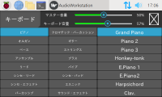
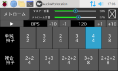
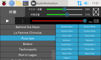

# AudioWorkstation
USB MIDI 鍵盤を繋げて、ピアノ風の演奏を楽しみたいなぁ
### 機能
- MIDI Synthesizer
- メトローム
- Standard MIDI File 伴奏

### 構成
- ハードウェア
    - Raspberry Pi 4 Model B/4GB (Raspberry Pi OS with desktop 64bit)
    - microSD card 32GB 
    - 4.3inch DSI LCD with case ([Waveshare 18645][1] )
    - USB-DAC ([Sharkoon GAMING DAC PRO S][2] )
    - USB-MIDI Keyborad ([M-AUDIO KEYSTATION49 MK3][3] )
- ソフトウェア
    - JACK Audio Connection Kit version 1.9.17
    - FluidSynth version 2.1.7
    - Python version 3.9.2
    - Kivy[base] version 2.1.0
---
## 準備
~~~sh
# 日本語フォント
~ $ sudo apt -y install fonts-ipaexfont
# jackd(jackd2) with qjackctl 
# fluidsynth with libfluidsynth2, qsynth, fluid-soundfont-gm)
~ $ sudo apt -y install jackd pulseaudio-module-jack fluidsynth
~~~
> Bluetoothデバイスへ出力するには、[BlueALSA](docs/bluetooth-devices.md)を参照
## インストール
~~~sh
~ $ python3 -m venv AudioWorkstation/venv --upgrade-deps
~ $ cd AudioWorkstation
~/AudioWorkstation $ source venv/bin/activate
(venv) ~/AudioWorkstation $ pip install -U git+https://github.com/tomosatoP/AudioWorkstation.git
(venv) ~/AudioWorkstation $ initialize
# Audioworkstation/sf2フォルダにsf2サウンドフォントファイルを設置してね
# Audioworkstation/midフォルダにSMF(StandardMidiFile)ファイルを設置してね
(venv) ~/AudioWorkstation $ deactivate
~~~
## 実行
~~~sh
~ $ cd AudioWorkstation
~/AudioWorkstation $ source venv/bin/activate
(venv) ~/AudioWorkstation $ python3 -m audioworkstation
# 終わったら
(venv) ~/AudioWorkstation $ deactivate
~~~
## アンインストール
~~~sh
~ $ rm -rf AudioWorkstation
~~~

[1]:https://www.waveshare.com/4.3inch-dsi-lcd-with-case.htm
[2]:https://ja.sharkoon.com/product/27415
[3]:https://m-audio.com/keystation-49-mk3